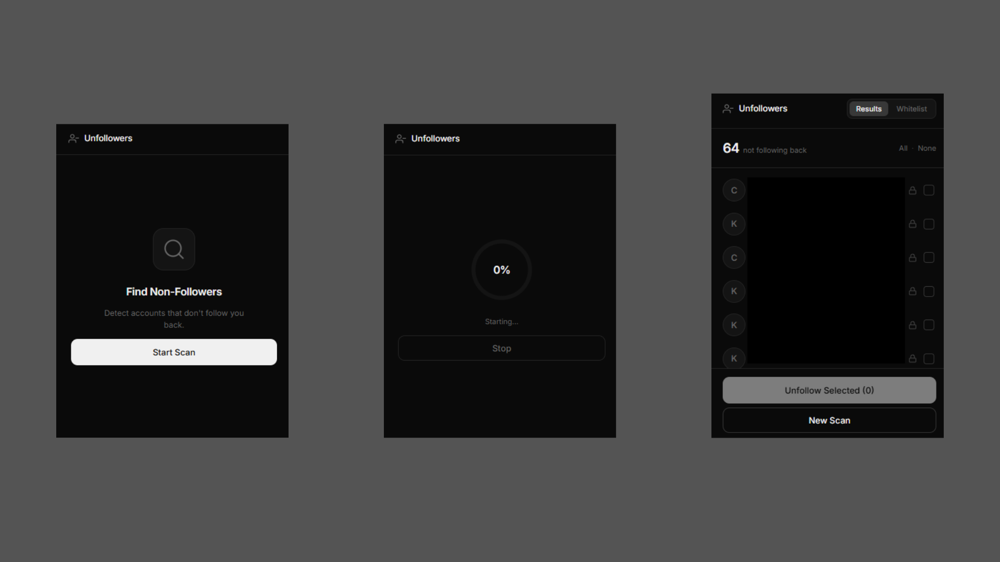

# Instagram Unfollower Detector

A lightweight, secure, and modern Chrome extension to find out who isn't following you back on Instagram.

## Screenshots

  

## Features

- Accurate Scanning: Fetches your Following and Followers to find the discrepancy.
- Safety First: Implements random delays and safety breaks to mimic human behavior and protect your account from rate limits.
- Whitelist: Add accounts you want to keep following (e.g., celebrities, brands) to a permanent whitelist so they never show up in results.
- Bulk Unfollow: Select specific users and unfollow them directly from the extension.
- Modern UI: Sleek, dark-mode interface with progress tracking.

## Installation

1. Download or clone this repository.
2. Open Chrome and navigate to chrome://extensions/.
3. Enable "Developer mode" in the top right corner.
4. Click "Load unpacked" and select the folder where you saved this project.

## Safety Warning

This tool is for personal use. Instagram has strict rate limits for unfollowing/following. The extension includes built-in protective pauses, but use it responsibly. We recommend not unfollowing more than 50-100 people per day.

---

Built using AI.
